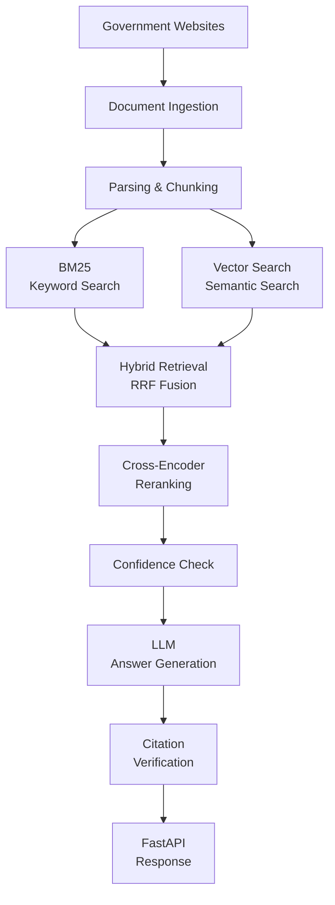
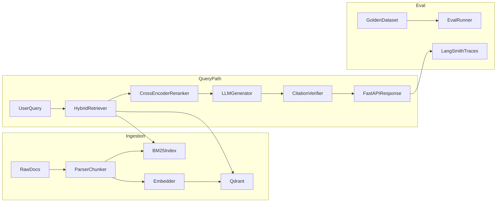

# Project CarePolicy

Hello, dear reader!
This is a project exploring how to build a reliable RAG (Retrieval-Augmented Generation) system that answers questions about Singapore public healthcare policy, with **verified citations** and **honest refusals** when it does not have relevant information.

**Note:** This is an educational project, not a medical or legal advice tool. It was built only on publicly available documentation.

## Why did I build this project?

I wanted to go beyond a basic RAG chatbot. 

A simple RAG system can retrieve a document, send it to a LLM, and generate an answer. I wanted to understand what happens when we care more about where the answer came from and when the system should not answer. And also how to evaluate different retrieval approaches and build an end-to-end RAG pipeline.

Real question-answering systems fail in three places: retrieval accuracy, citation integrity, and knowing when *not* to answer. This project aims to tackles all three:

- **Hybrid retrieval** : BM25 keyword search + dense vector search, fused with Reciprocal Rank Fusion, then reranked by a cross-encoder
- **Verified citations** : every claim in an answer carries a `[1]`-style marker that is checked against the retrieved sources after generation
- **Refusal gate** : if retrieval confidence is low, the system refuses instead of hallucinating (100% refusal accuracy on the eval set)
- **Measured quality** : a 75-question golden evaluation set with an ablation study across retrieval modes

## What I built

The system follows this general flow:




For each question, the system:

1. Rewrite the question if needed
2. Retrives documents using both BM25 and vector search
3. Combines the results using Reciprocal Rank Fusion (RRF) (Top 25)
4. Reranks the results using a cross-encoder (Top 5)
5. Checks retrieval confidence
6. Generates an answer using the retrieved information
7. Verifies the citations in the generated answer
8. Returns the answer, citations and confidence information through an API

## What I learned

### **Takeaway 1: Keyword search and vector search have different strengths.**

BM2 is useful when question contains specific terms or names. Vector search is useful when the question and document use different wording but have similar meaning.

Therefore, I combined both approaches using Reciprocal Rank Fusion (RRF) and then used a cross-encoder to rerank the results.

### **Takeaway 2: Citations are not automatically trustworthy.**

LLMs can generate a citation that look correct even when the retrieved information does not actually support the answer.   

To explore this problem, I added a citation verification step after generation. The system checks that each `[N]` citation points to a chunk that was actually retrieved and that the source belongs to an expected domain. It does not gurantee that every statement is factually correct, but it gives me a way to detect invalid citations.

### **Takeaway 3: The correct answer can be "I don't know."**

One of the things I wanted learn was how to prevent the system from answering questions that are outside its knowledge.

For example:
"What is the stock price of Apple today?"

This is unrelated to the healthcare policy documents in the corpus, so the system should refuse rather than invent an answer. Therefore, I added a confidence gate that uses the reranking score to decide whether the retrieved information is strong enough to answer.

## Results

The RAG system was evaluated on 75 hand-curated questions (subsidies, screening, policy, PDPA compliance, refusal traps) against a live corpus of 74 government pages:


| Retrieval Mode   | Success rate | Refusal accuracy | Citation accuracy | Answer similarity | p95 latency |
| ---------------- | ------------ | ---------------- | ----------------- | ----------------- | ----------- |
| Dense only       | 100%         | 100%             | 100%              | 0.75              | 14.8 s      |
| BM25 only        | 97.3%        | 97.3%            | 100%              | 0.73              | 7.0 s       |
| **Hybrid (RRF)** | **100%**     | **100%**         | **100%**          | **0.75**          | **7.5 s**   |


The main result I found interesting was that hybrid retrieval reached the same measured accuracy as dense retrieval at roughly half the latency. The evaluation reports are available in `data/eval/`.

**How to read these numbers.** 

Success rate, refusal accuracy, and citation accuracy are *structural* checks:   
1. the system answered exactly when it should,   
2. the system refused exactly when it should, and  
3. every `[N]` citation marker resolves to an actually-retrieved chunk from an expected source domain.  
  
The 100% structural scores should not be interpreted as "the system is perfect".

The current evaluation set is relatively small and contrains mostly single-step questions that are phrased close to the source material. They deliberately do not judge whether the answer's content is correct, which is why they saturate at 100%.

**Answer similarity** is the correctness proxy. Here, cosine similarity is between the generated answer's embedding and a hand-written reference answer (refusal questions excluded). It is not expected to reach 1.0. The current score is around 0.75.

## Architecture




## Tech stack


| Component      | Technology                                        |
| -------------- | ------------------------------------------------- |
| API            | FastAPI                                           |
| Vector DB      | Qdrant                                            |
| Keyword search | BM25 (rank_bm25)                                  |
| Fusion         | Reciprocal Rank Fusion                            |
| Reranker       | cross-encoder/ms-marco-MiniLM-L-6-v2 (local, CPU) |
| LLM            | OpenAI gpt-4o-mini                                |
| Embeddings     | OpenAI text-embedding-3-small                     |
| Scraping       | httpx + Playwright                                |
| Eval           | Custom golden set + ablation runner               |
| Config         | pydantic-settings (`.env`)                        |


## Corpus

The current corpus contains 74 live pages scraped from official sources, and split into 203 searchable chunks.


| Source    | Domain       | Content                             | Docs |
| --------- | ------------ | ----------------------------------- | ---- |
| HealthHub | healthhub.sg | Subsidies, screening, prevention    | 34   |
| MOH       | moh.gov.sg   | Schemes, subsidies, policy          | 25   |
| HPB       | hpb.gov.sg   | Screening, prevention               | 7    |
| PDPC      | pdpc.gov.sg  | PDPA compliance and data protection | 8    |


The source catalogue is stored in `data/sources/urls.json`.

The scripts `scripts/check_urls.py` validates it for link rot.

  
**Why is PDPA in a healthcare corpus?** 

  
I wanted the project to cover more than just patient-facing healthcare questions.  
  
Singapore healthcare organizations handle sensitive patient data, so PDPA obligations such as consent, appointing a Data Protection Officer, breach notification, retention limits are part of everyday healthcare policy compliance. 

## Getting Started

Note: The following guide has been written with AI assistance.   
  
To set this up, you will need Python 3.11+ and an OpenAI API key.

```powershell
# 1. Install
python -m venv .venv
.venv\Scripts\activate
pip install -e ".[dev]"

# 2. Configure
copy .env.example .env
# Edit .env: set OPENAI_API_KEY (required). 

# 3. Build the corpus and start the API
python scripts/check_urls.py
python scripts/scrape_corpus.py --purge-live
python scripts/ingest_all.py --skip-fetch
uvicorn src.api.main:app --reload --port 8000
```

Then open Swagger and authorize (see [Try the API](#try-the-api) below).

  
**Why do seed documents exist?**

For offline development, the project includes seed documents so that the pipeline can be tested without accessing the live websites.  
  
The live and seed corpora are kept separate so that they cannot accidentally be mixed together.

The published evaluation results use the **live corpus**, not the seed documents.

The published eval numbers are measured against the live corpus only.

  
**Alternatively: One-command start (Windows):** `.\scripts\start.ps1` runs first-time ingestion if needed and starts the API.

## Run the evaluation

```powershell
python -m src.eval.run_eval --mode hybrid      # 75-question golden set
python -m src.eval.run_eval --mode ablation    # dense vs BM25 vs hybrid
```

Reports are written to `data/eval/`. Regenerate the golden set with `python scripts/build_golden_live.py`.

### Reading the reports

Each run writes `data/eval/report_<mode>.json` containing a `summary` block plus per-question `results` — the per-question rows (confidence, latency, individual metric flags) are what you drill into when something fails. `ablation_report.json` puts the three mode summaries side by side.

Metric definitions (computed in `src/eval/metrics.py`):


| Metric            | Meaning                                                                                                                                          |
| ----------------- | ------------------------------------------------------------------------------------------------------------------------------------------------ |
| Success rate      | Answered without refusal, citations valid, and a cited domain matches the expected source. Refusal questions count as success only when refused. |
| Refusal accuracy  | Refused exactly when the golden set expects a refusal — no false refusals, no answers out of scope.                                              |
| Citation accuracy | Share of `[N]` markers in the answer that resolve to an actually-retrieved chunk.                                                                |
| Answer similarity | Embedding cosine similarity between the generated answer and a hand-written reference answer. The correctness proxy; refusal questions excluded. |
| Confidence        | Top cross-encoder rerank score for the query — the value the refusal gate compares against its threshold.                                        |
| Latency avg / p95 | End-to-end per-question time, including retrieval, rerank, generation, and verification.                                                         |


See the note under [Results](#results) for why the structural metrics saturate at 100% while answer similarity does not.

## Try the API

Do note, there is **one** app credential for callers: `API_KEY`. This is **not** your OpenAI key!!


| Variable         | Purpose                               |
| ---------------- | ------------------------------------- |
| `OPENAI_API_KEY` | Calls OpenAI for embeddings + answers |
| `API_KEY`        | Protects `POST /query`                |


### Local Swagger walkthrough

1. Start the API (`uvicorn` or `.\scripts\start.ps1`)
2. Open [http://localhost:8000/docs](http://localhost:8000/docs)
3. Click **Authorize**
4. Paste the value of `API_KEY` from your `.env` (default from `.env.example`):
  ```
   carepolicy-demo-OMpV3kCmzqcsr7v2w-8dNg
  ```
5. Call `POST /query` with a body like:

```json
{ "question": "What is CHAS and who is eligible?" }
```

  
Other good test questions:


| Question                                      | Expected                                     |
| --------------------------------------------- | -------------------------------------------- |
| `What is CHAS and who is eligible?`           | Cited answer (`healthhub.sg` / `moh.gov.sg`) |
| `What is the PDPA consent obligation?`        | Cited answer (`pdpc.gov.sg`)                 |
| `What is the stock price of Apple Inc today?` | `refused: true`                              |


Rate limit: **30 requests / minute** per API key. Responses include `answer`, `citations` (with live URLs), `confidence`, `refused`, and `citation_verification`.

### Generate your own key

```powershell
python -c "import secrets; print(secrets.token_urlsafe(16))"
```

## API


| Endpoint  | Method | Auth               | Description                             |
| --------- | ------ | ------------------ | --------------------------------------- |
| `/health` | GET    | none               | Status + active LLM provider            |
| `/query`  | POST   | `X-API-Key` header | RAG query with citations (rate-limited) |


## Project structure

```
src/
├── ingestion/     fetch (httpx + Playwright), parse, chunk
├── retrieval/     BM25, Qdrant vector store, RRF hybrid, cross-encoder rerank
├── generation/    prompts, answer generation, citation verification
├── eval/          golden-set runner, metrics
├── api/           FastAPI app
└── pipeline.py    end-to-end orchestration
scripts/           corpus scraping, ingestion, eval tooling
data/              URL catalog, golden set, eval reports (indexes are gitignored)
```

## Limitations

There are still several limitations in the current version.

- The system only uses public sources, so information may become outdated when government policies change.
- It is not a replacement for professional medical or legal advice.
- The current p95 latency of around 7.5 seconds is still prototype-level.
- The evaluation set is relatively small.
- Many evaluation questions are single-hop and close to the wording of the source documents.
- The current answer similarity score is around 0.75, so there is still room to improve answer quality.


## License

Portfolio / educational use.