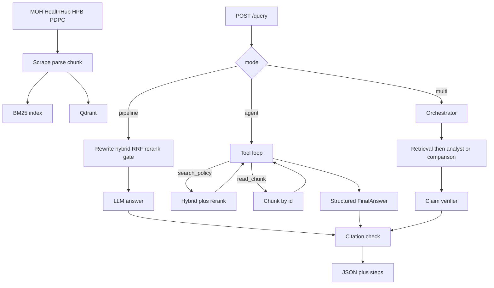
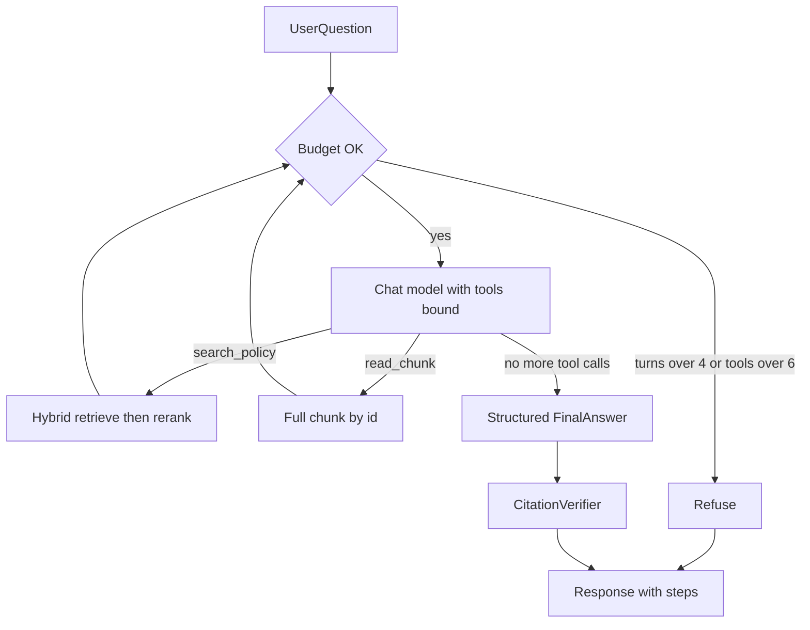
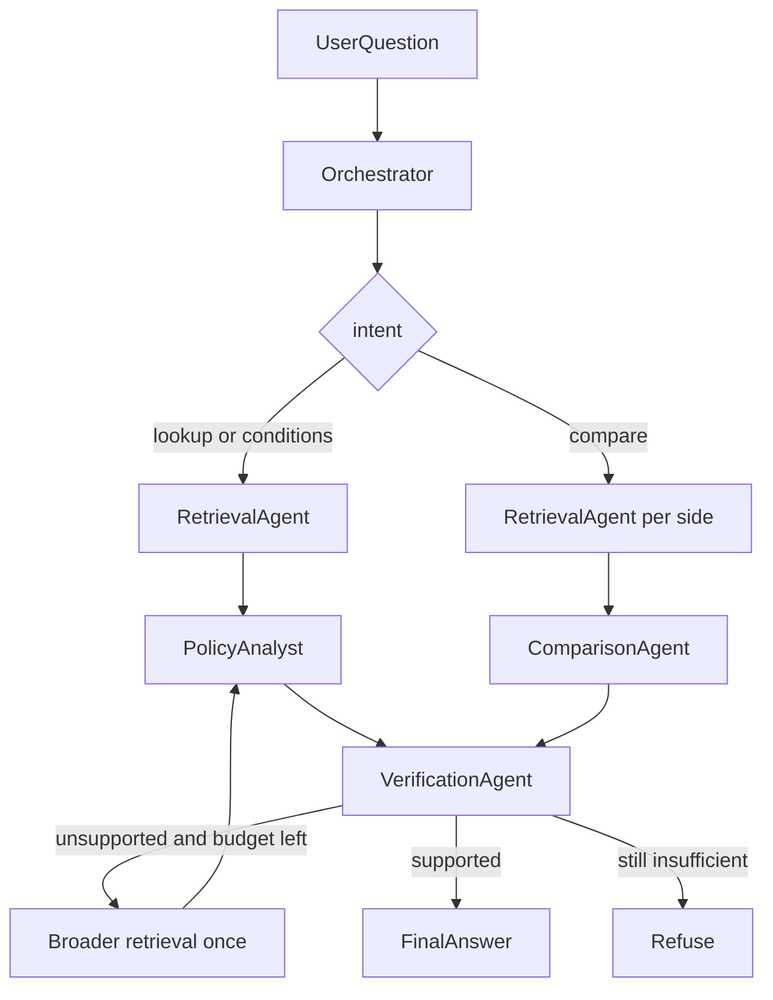
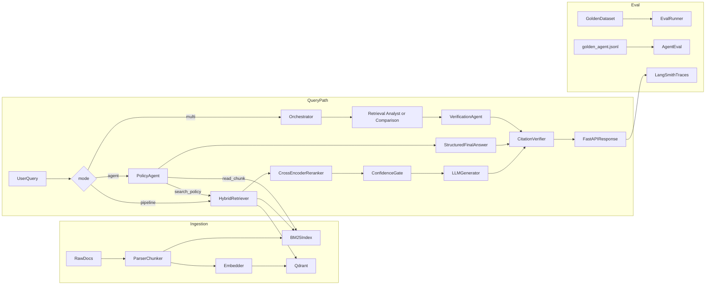

# Project CarePolicy
#### Live Demo: https://huggingface.co/spaces/SamsLookingGlass/carepolicy-rag

Hello dear reader!  
I built this to see what a careful RAG system looks like when the answers are about Singapore public healthcare policy. The boring version of RAG is: retrieve a page, send it to a model, print some text. I wanted to sit with the parts that usually go wrong - did we retrieve the right thing, does the citation actually point at a real source, and should we have answered at all?

**Note:** This is an educational project on public government pages. It is not medical or legal advice.


## Why did I build this project?

A pipeline that retrieves **once** is enough for “What is CHAS?” It is a bad fit for “Compare CHAS and MediShield Life” or “CHAS eligibility *and* the PDPA consent rule.” One search dumps two topics into one bag of chunks, and the second topic often loses context.

I also did not want a chatbot that invents a subsidy when the pages are silent. So I kept coming back to four things:

- **Hybrid retrieval**: BM25 for exact names, dense search for paraphrases, fused with Reciprocal Rank Fusion, then a cross-encoder to rerank
- **Citation checks**: every factual claim is supposed to carry a `[1]`-style marker, and I verify that marker against chunks that were actually retrieved
- **Refusal**: if retrieval looks weak, say so instead of guessing
- **Measurement**: a 75-question set for retrieval, and a smaller set later when I added agents

The agents came after, when I noticed the pipeline could not decide to search a second time. `mode=agent` is one model with two tools. `mode=multi` is an orchestrator that routes the question, then specialists write into shared state. Same indexes. Different control flow.

## What I built

`POST /query` has three modes. Default is `pipeline` so the 75-question retrieval numbers stay comparable. Ingestion is shared.




### Pipeline (`mode=pipeline`)

This is the path I trust for a single, well-phrased question.

1. Rewrite the question if needed (expand acronyms such as CHAS)
2. Retrieve with both BM25 and vector search
3. Fuse the two lists with Reciprocal Rank Fusion (top 20)
4. Rerank with a cross-encoder (top 5)
5. Refuse if even the best chunk scores below the threshold
6. Generate an answer from those chunks
7. Check that every `[N]` points at a retrieved chunk
8. Return the answer, citations, and confidence

The other two modes use the **same** indexes. They just get to retrieve more than once.

## Single-agent loop (`mode=agent`)

I considered growing the pipeline — run two hardcoded searches for any question that contains “compare.” That felt brittle. I would have been encoding my own idea of a comparison instead of letting the model notice it needed another query.

So the agent is still RAG. It does not browse the web. It only calls two tools that wrap the hybrid retriever and the chunk store. The difference is who decides the next search: my code, or the model.

### What the loop does

1. Send the question to the chat model with `search_policy` and `read_chunk` bound
2. Cap it at 4 model turns and 6 tool calls. If it hits either limit, refuse — I did not want a loop that searches forever
3. `search_policy` runs hybrid retrieve + rerank. Optional `domain` keeps one search on HealthHub, MOH, HPB, or PDPC
4. `read_chunk` returns the full text of a hit
5. Append the observation and go again
6. When it stops calling tools, ask for a structured object: `answer`, `citation_indices`, `refused`. Refusal is a boolean, not a magic sentence
7. Run the same `[N]` check as the pipeline
8. Return the answer plus a `steps` trace (pipeline responses send `steps: []`)




| Tool            | Arguments                         | What it returns                                                                    |
| --------------- | --------------------------------- | ---------------------------------------------------------------------------------- |
| `search_policy` | `query`, optional `domain`        | Top reranked snippets with `chunk_id`, title, URL, domain, score, `citation_index` |
| `read_chunk`    | `chunk_id` from a previous search | Full chunk text                                                                    |


Limits live in config (`agent_max_model_turns=4`, `agent_max_tool_calls=6`). This path needs a chat model. The extractive fallback stays on the pipeline only — I did not want a fake agent when there is no LLM.

A typical comparison call looks like this:

```json
{
  "question": "Compare CHAS and MediShield Life eligibility.",
  "mode": "agent"
}
```

```json
{
  "answer": "CHAS subsidises GP care for Singapore Citizens [1]. MediShield Life covers citizens and PRs [2].",
  "refused": false,
  "steps": [
    {
      "tool": "search_policy",
      "arguments": {"query": "CHAS eligibility", "domain": "healthhub.sg"},
      "observation": {"results": [{"citation_index": 1, "domain": "healthhub.sg"}]}
    },
    {
      "tool": "search_policy",
      "arguments": {"query": "MediShield Life eligibility", "domain": "moh.gov.sg"},
      "observation": {"results": [{"citation_index": 2, "domain": "moh.gov.sg"}]}
    }
  ]
}
```


## Multi-agent workflow (`mode=multi`)

After the single agent worked, I still had a gap. One model *can* search twice, but the run is a blob of tool calls. I could not point at “this question was routed as a comparison” or “this claim failed and we searched again.”

I thought about pulling in LangGraph or a multi-agent library. For four roles and one retry, that felt like more framework than problem. The loop is in `src/agent/workflow.py`.




The orchestrator only plans. It picks `lookup`, `comparison`, `conditions`, or `out_of_scope` and names the search subtasks. It does not write the user-facing answer. Everyone else reads and writes the same state object: query, intent, subtasks, chunks, claims, verification, budget, trace.


| Intent                                 | Who runs after retrieval                          |
| -------------------------------------- | ------------------------------------------------- |
| `lookup`, `conditions`, `out_of_scope` | Policy analyst, then verifier                     |
| `comparison`                           | Comparison agent (not the analyst), then verifier |


A few constraints I set on purpose:

- A lookup must not call the comparison agent. Otherwise I am paying for a specialist I do not need.
- A comparison searches once per side.
- `out_of_scope` still gets one search, in case the question was closer to the corpus than it looked.
- “What changed between the 2025 and 2026 CHAS policy?” still refuses. These pages are a snapshot, not a versioned archive. I considered treating that as a comparison. The corpus cannot support it, so I would have been pretending.

**When retrieval fails.** No hits, or every claim comes back `unsupported`: drop the domain filters, search once more, run the analyst or comparison again, verify again. Still thin: refuse. This API is one request, so the refusal *is* the clarification. I did not add a chat turn that asks the user to rephrase.

**What the verifier actually does.** Each claim is checked against the cited chunk text (`supported` / `unsupported`). Only supported claims go into the final answer. The `[N]` index check still runs after that. Both are support checks. Neither proves the sentence is medically correct.

**What I log.** Each step has `request_id`, `step_number`, `agent`, `tool`, input/output, `latency_ms`, `tokens`, `status`, and `retry`. Tokens come from the provider when it sends `usage_metadata`. Cost is tokens times a small `gpt-4o-mini` constant in config — an estimate, labelled as one. The response also has a short `trace`:

```
User
 ↓
orchestrator (comparison) 180ms
 ├─ search_policy 420ms ✓
 ├─ read_chunk 20ms ✓
 ├─ search_policy 390ms ✓
 ├─ read_chunk 15ms ✓
 ↓
comparison 900ms
 ↓
verification 400ms
 ↓
Final Answer
```

```json
{
  "question": "Compare CHAS and MediShield Life: who is eligible for each?",
  "mode": "multi"
}
```


## My takeaways


### Takeaway 1: Keyword search and vector search are good at different things

BM25 is useful when the question contains a specific name. Vector search is useful when the question and the page use different wording. That is why I fused them with RRF and then reranked. On the latest 75-question run, hybrid matched dense (97.3% success) and was faster (3.5 s p95 vs 4.9 s). BM25-only dropped to 93.3%.

### Takeaway 2: Citations that look right can still be junk

The model can emit `[3]` even when chunk 3 does not support the sentence. I check that each marker points at a retrieved chunk from an expected domain. That does not guarantee the statement is true. It does catch invented markers. The multi-agent verifier is the next notch: claim vs chunk text, keep only `supported`.

### Takeaway 3: The correct answer can be “I don’t know”

“What is the stock price of Apple today?” is outside this corpus. Guessing a healthcare-shaped answer would be worse than refusing. The pipeline uses the rerank score against `rerank_score_threshold` (0.25). The agents refuse when the tools do not turn up enough, or the budget runs out.

### Takeaway 4: An extra search is expensive, so I did not make the agent the default

Each extra `search_policy` is another retrieve + rerank. Each model turn is another LLM call. That is worth it when the user is comparing two schemes or mixing CHAS with PDPA. It is not worth it for “What is CareShield Life?” `mode=pipeline` stays the default. The 75-question ablation stays the retrieval baseline.

### Takeaway 5: A second search is not the same as a workflow

I only added the orchestrator once I needed routing, a handoff, and a failed claim sent back for one more search. I also decided not to add a calculator specialist — the pages are narrative, not a tariff table — and not to treat year-over-year questions as comparisons.

## Results

I re-ran everything on 28 September 2026 against a fresh scrape (74 pages, 214 chunks). 

**Retrieval ablation**: 75 questions (subsidies, screening, policy, PDPA, refusal traps). Same questions, only the retriever changes.


| Retrieval        | Success   | Refusal   | Citation | Answer similarity | p95       |
| ---------------- | --------- | --------- | -------- | ----------------- | --------- |
| Dense only       | 97.3%     | 97.3%     | 100%     | 0.73              | 4.9 s     |
| BM25 only        | 93.3%     | 93.3%     | 100%     | 0.70              | 3.4 s     |
| **Hybrid (RRF)** | **97.3%** | **97.3%** | **100%** | **0.73**          | **3.5 s** |


You can find the reports here: `data/eval/ablation_report.json`.

**Architecture compare**: 12 questions written for tool use and routing (`data/eval/golden_agent.jsonl`). I did not put the 75-question set through all three architectures. Those items are mostly one-hop; the “right” agent trajectory would just be one search, and a 100% tool score would not mean much.


| Architecture | Success | Citation | Avg steps | p95    | Cost (est.) |
| ------------ | ------- | -------- | --------- | ------ | ----------- |
| Pipeline     | 83.3%   | 100%     | —         | 4.9 s  | —           |
| Single agent | 91.7%   | 83.3%    | 2.8       | 17.3 s | —           |
| Multi-agent  | 91.7%   | 100%     | 6.8       | 7.9 s  | $0.021      |


What I took from this run: the pipeline refused a comparison that both agent paths answered. Multi-agent kept `[N]` markers valid (100% vs 83.3%) and was faster than the open tool loop, at the cost of more steps (6.8 vs 2.8). Route accuracy — did the orchestrator pick `lookup` / `comparison` / `conditions` / `out_of_scope`? - was 75%. The dollar figure is an estimate for the 12-question multi-agent run only. The single-agent loop does not record tokens yet.   

You can find the report here: `data/eval/architecture_compare.json`.

**How I read the scores.** Success, refusal, and citation are structural: did it answer or refuse when it should, and does every `[N]` resolve to a retrieved chunk? They are not “the system is perfect.” The set is small. They do not judge whether the sentence is factually correct. Answer similarity is cosine similarity to a hand-written reference (refusals excluded). I use ~0.73 as a correctness proxy, not a target of 1.0.

## Architecture




## Tech stack


| Piece            | What I used                                                             |
| ---------------- | ----------------------------------------------------------------------- |
| API              | FastAPI, `X-API-Key`, 30 req/min                                        |
| Search           | BM25 + Qdrant, RRF, `cross-encoder/ms-marco-MiniLM-L-6-v2` (local CPU)  |
| LLM / embeddings | OpenAI `gpt-4o-mini` / `text-embedding-3-small` (Azure is wired up too) |
| Scrape           | httpx + Playwright                                                      |
| Agents           | LangChain `bind_tools` and structured output. The graph is my loop.     |
| Eval             | 75-question golden set + 12-question agent set                          |
| Config           | pydantic-settings, `.env`                                               |


Local Qdrant lives on disk (`QDRANT_MODE=local`).

## Corpus

74 live pages from `data/sources/urls.json`, split into 214 chunks. `scripts/check_urls.py` checks for dead links. PDPC is JavaScript-heavy, so those rows are `fetch: "browser"`.


| Source    | Domain       | What’s on the pages              | Pages |
| --------- | ------------ | -------------------------------- | ----- |
| HealthHub | healthhub.sg | Subsidies, screening, prevention | 34    |
| MOH       | moh.gov.sg   | Schemes, subsidies, policy       | 25    |
| HPB       | hpb.gov.sg   | Screening, prevention            | 7     |
| PDPC      | pdpc.gov.sg  | PDPA, DPO, consent               | 8     |


I put PDPA in a healthcare corpus because hospitals handle patient data. Consent, appointing a DPO, and breach rules show up in everyday compliance, not only in a privacy seminar.

For offline work, `python scripts/ingest_all.py --seed-only` loads bundled seed docs. Seeds and live HTML are kept in separate piles so they cannot mix. The numbers above are from the live scrape only.

## How to Get Started

Python 3.11+ and an OpenAI key. For the full live scrape, including PDPC, you also need Playwright:

```powershell
python -m venv .venv
.\.venv\Scripts\activate
pip install -e ".[dev,browser]"
playwright install chromium

copy .env.example .env
# set OPENAI_API_KEY
# set API_KEY if you do not want the default

python scripts/scrape_corpus.py --purge-live
python scripts/ingest_all.py --skip-fetch
uvicorn src.api.main:app --reload --port 8000
```

On Windows, `.\scripts\start.ps1` runs first-time ingest if `data/processed/chunks.jsonl` is missing, then starts the API.

Open [http://localhost:8000/docs](http://localhost:8000/docs), click **Authorize**, and paste `API_KEY` from your `.env`. That key protects `POST /query`. It is not your OpenAI key. The next section is the request and response shape.

To mint your own app key:

```powershell
python -c "import secrets; print(secrets.token_urlsafe(16))"
```

## API

I kept the HTTP surface small on purpose. The interesting work is inside the pipeline or the agent loop. I did not want a separate endpoint per mode, so `POST /query` takes a `mode` field and everything else stays the same path.

| Method | Path | Auth | What it is for |
| --- | --- | --- | --- |
| `GET` | `/` | open | Service name, docs link, and the three modes |
| `GET` | `/health` | open | Liveness plus which LLM provider is active |
| `POST` | `/query` | `X-API-Key` | Ask a question |

`GET /health` is the one I hit while the server is coming up. It does not touch the indexes. `POST /query` is the only call that retrieves and generates.

**Auth and rate limit.** I did not want the OpenAI key on the client, so the app key is a second secret in `.env`. Missing or wrong key: `401`. I also cap each key at 30 requests per 60 seconds (`429`). The limit and window are closed over in the FastAPI dependency — if they were query parameters, a caller could send `?limit=999999` and walk around their own cap.

`agent` and `multi` need a chat model. If there is no OpenAI or Azure key, those modes return `503` instead of pretending to be an agent with the extractive fallback.

**Request.** `question` is the only required field (3–2000 characters).

```json
{
  "question": "What is CHAS and who is eligible?",
  "mode": "pipeline",
  "retrieval_mode": "hybrid",
  "skip_rerank": false
}
```

| Field | Default | Notes |
| --- | --- | --- |
| `question` | — | The user question |
| `mode` | `pipeline` | `pipeline`, `agent`, or `multi` |
| `retrieval_mode` | `hybrid` | `hybrid`, `dense`, or `bm25`. Only the pipeline uses this. I left it on the request so I can A/B the retriever without changing code. |
| `skip_rerank` | `false` | Pipeline only. I used this when I wanted to see the fused list before the cross-encoder. |

`mode=agent` and `mode=multi` ignore `retrieval_mode` and `skip_rerank`. Those paths always go through the hybrid retriever plus rerank, then decide whether to search again.

```powershell
curl http://localhost:8000/query `
  -H "X-API-Key: YOUR_API_KEY" `
  -H "Content-Type: application/json" `
  -d "{`"question`": `"What is CHAS and who is eligible?`"}"
```

```powershell
curl http://localhost:8000/query `
  -H "X-API-Key: YOUR_API_KEY" `
  -H "Content-Type: application/json" `
  -d "{`"question`": `"Compare CHAS and MediShield Life: who is eligible for each?`", `"mode`": `"multi`"}"
```

**Response.** Every mode returns the same object. Unused fields stay empty rather than disappearing, so a client does not have to branch on the schema.

```json
{
  "answer": "CHAS subsidises outpatient care at participating GPs for eligible Singapore Citizens [1].",
  "citations": [
    {
      "index": 1,
      "chunk_id": "...",
      "title": "Community Health Assist Scheme (CHAS)",
      "url": "https://www.healthhub.sg/...",
      "domain": "healthhub.sg",
      "snippet": "..."
    }
  ],
  "confidence": 0.81,
  "latency_ms": 3420.12,
  "retrieval_mode": "hybrid",
  "chunks_used": 5,
  "refused": false,
  "citation_verification": {"valid": true, "issues": []},
  "steps": [],
  "intent": "",
  "trace": "",
  "tokens": 0,
  "estimated_cost_usd": 0.0,
  "retry_count": 0
}
```

| Field | What I put there |
| --- | --- |
| `answer` | Generated text, or a refusal sentence |
| `citations` | Retrieved chunks that the `[N]` markers are supposed to point at |
| `confidence` | Top cross-encoder score. The pipeline gate compares this to `rerank_score_threshold` (0.25). |
| `latency_ms` | End-to-end time for this request |
| `retrieval_mode` | Echo of the retriever used. Agent paths report `agent` / `multi`. |
| `chunks_used` | How many chunks went into generation |
| `refused` | Boolean. I did not want to parse a magic sentence to know if it declined. |
| `citation_verification` | Did every `[N]` resolve to a retrieved chunk? |
| `steps` | Tool / specialist trace. Pipeline sends `[]`. |
| `intent` | Multi only: `lookup`, `comparison`, `conditions`, or `out_of_scope` |
| `trace` | Multi only: the short ASCII tree of who ran |
| `tokens` / `estimated_cost_usd` | Multi only, and only when the provider sends usage. Cost is an estimate. |
| `retry_count` | Multi only: 0 or 1. There is one broader-search retry, then refuse. |

| Question | What I expect |
| --- | --- |
| What is CHAS and who is eligible? | Cited answer, healthhub.sg / moh.gov.sg |
| What is the PDPA consent obligation? | Cited answer, pdpc.gov.sg |
| Compare CHAS and MediShield Life… with `mode=agent` or `multi` | Two searches in `steps` |
| What is the stock price of Apple Inc today? | `refused: true` |

## Evaluation

```powershell
python -m src.eval.run_eval --mode hybrid
python -m src.eval.run_eval --mode ablation
python -m src.eval.run_eval --mode agent
python -m src.eval.run_eval --mode agent-compare
python -m src.eval.run_eval --mode multi
python -m src.eval.run_eval --mode architecture-compare
```

Reports land in `data/eval/`. Rebuild the 75-question file with `python scripts/build_golden_live.py`.

When something fails I open the per-question rows, not just the summary. `ablation_report.json` puts dense / BM25 / hybrid side by side.


| Metric                                           | What I meant by it                                                                               |
| ------------------------------------------------ | ------------------------------------------------------------------------------------------------ |
| Success rate                                     | Answered when it should, citations valid, right domain. Refusal questions only count if refused. |
| Refusal accuracy                                 | Refused exactly when the golden row says to.                                                     |
| Citation accuracy                                | Share of `[N]` markers that point at a retrieved chunk.                                          |
| Answer similarity                                | Embedding cosine vs the reference. Refusals skipped.                                             |
| Confidence                                       | Top cross-encoder score — what the pipeline gate compares to its threshold.                      |
| Latency avg / p95                                | End-to-end time, including retrieve, rerank, generate, verify.                                   |
| Tool-call count / expected tools                 | Did it call `search_policy` / `read_chunk` at least as often as the golden row asked?            |
| Within budget                                    | Agent: ≤4 turns and ≤6 tools.                                                                    |
| Route accuracy                                   | Multi: orchestrator intent matches `expected_route`.                                             |
| Extra tool calls / retry rate / supported claims | Multi extras (`read_chunk` on the top hit counts), how often it retried, verifier pass rate.     |
| Tokens / cost                                    | Multi: provider usage when returned; cost is an estimate.                                        |


## Project layout

```
src/
├── api/            FastAPI — GET /health, POST /query
├── pipeline.py     Fixed RAG chain
├── agent/          tools, single-agent loop, multi-agent workflow
├── retrieval/      BM25, Qdrant, RRF, rerank, query rewrite
├── generation/     prompts, answer, citation check
├── ingestion/      httpx + Playwright fetch, parse, chunk
├── eval/           golden runner + metrics
├── config.py
└── llm_provider.py
scripts/            scrape, ingest, URL check, golden builder
tests/              unit tests with scripted models (no API key)
data/sources/       urls.json
data/eval/          golden sets + reports (indexes are gitignored)
```


## Limitations and Caveats

- The pages go stale when a ministry updates a scheme.
- This is not a clinician or a lawyer.
- Pipeline p95 is about 3.5 s on the 75-question set. Single-agent p95 was 17.3 s on the 12-question set; multi-agent 7.9 s. Still prototype-level.
- Both eval sets are small. Many 75-question items are phrased close to the source.
- Hybrid answer similarity is about 0.73.
- The `[N]` check and the claim verifier only tell me the source was retrieved and (in multi) that the chunk looks supportive. They do not prove the sentence is true.
- The 12-question set is for tools, routes, and refusals. It does not replace the retrieval ablation.

Strictly for educational use.
